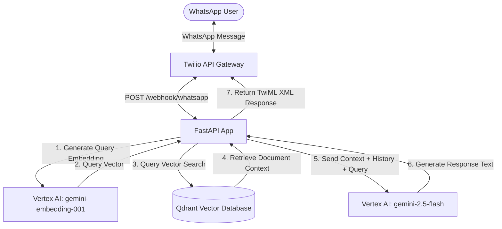
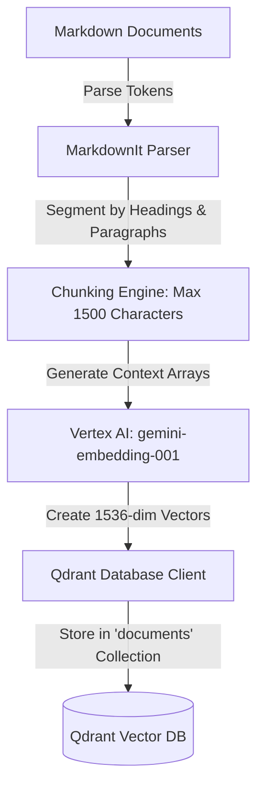
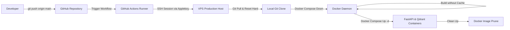

# Personal Knowledge Base WhatsApp Assistant

A Retrieval-Augmented Generation (RAG) assistant designed to answer questions about Vijay Singh using a structured personal knowledge base. The application exposes a FastAPI backend, uses Qdrant as a vector database for semantic search, utilizes Google Vertex AI for embedding and content generation, and integrates with Twilio to handle incoming messages from WhatsApp.

---

## Technical Architecture

The following diagram illustrates the interaction between the user, the FastAPI backend, the vector database, and the Google Vertex AI models:



---

## Technology Stack

<p align="left">
  <a href="https://skillicons.dev">
    
  </a>
</p>

The application is built using the following technologies and frameworks:

* **FastAPI**: A high-performance Web API framework for Python.
* **Qdrant**: A vector database used to store and perform similarity search on text embeddings.
* **Google Vertex AI SDK (google-genai)**: Used to generate text embeddings via `gemini-embedding-001` and to perform text generation via `gemini-2.5-flash`.
* **Twilio API**: Integrates the application with WhatsApp, converting incoming messages to webhooks and sending generated replies.
* **Docker & Docker Compose**: Simplifies deployment and runs the application alongside a local Qdrant database instance.
* **GitHub Actions**: Provides a CI/CD pipeline to deploy code updates automatically to a production VPS.

---

## System Features and Implementation Details

### 1. Document Parsing and Chunking (`app/chunking/chunk.py`)
To process the knowledge base files, the application implements a structural parsing process:
* **Source Files**: Text documents stored under `personal_knowledge_base` (including `family.md`, `personal.md`, `technical.md`, `about_me.md`, and `biography.md`).
* **Heading-Based Extraction**: Uses the `MarkdownIt` library to parse Markdown tokens. It extracts sections according to their heading levels (`#`, `##`, `###`), maintaining a heading stack. The path of parent headings (e.g., `["My Projects", "RAG Pipeline"]`) is associated with the text to preserve context.
* **Paragraph Splitting**: Sections are split into smaller paragraphs (using double newlines).
* **Length-Constrained Chunking**: Paragraphs are grouped into chunks with a limit of 1500 characters. If a paragraph exceeds the limit when combined with previous text, it starts a new chunk to avoid loss of context.

### 2. Semantic Search and Ingestion (`app/api/embedding.py` and `app/services/vector_service.py`)
* **Collection Lifespan Init**: During startup, the application verifies the existence of the Qdrant collection (configured by environment variables, default is `documents`). If it does not exist, the collection is created with `1536` dimensions using **Cosine Distance**.
* **Vector Generation**: Text chunks are sent to the Google Vertex AI embedding client (`gemini-embedding-001`) with the task type set to `RETRIEVAL_DOCUMENT` to produce 1536-dimensional float vectors.
* **Database Upsert**: The generated embeddings, alongside metadata payloads (source filename, heading path, raw text, and chunk index), are stored in the Qdrant database using unique UUIDs.



### 3. Contextual Generation and Session Management (`app/api/controller.py`)
* **Vector Retrieval**: User queries are embedded using the same Vertex AI model and searched against the Qdrant database. The system retrieves the top 3 matching chunks based on Cosine Similarity.
* **Session Storage (`app/core/session_storage.py`)**: An in-memory storage manager (`ChatStorage`) tracks conversation history for each unique sender (identified by their WhatsApp phone number). This maintains conversational context across turns.
* **LLM Prompting**: The retrieved context, query, and session history are combined into a system prompt. The prompt directs the Google GenAI `gemini-2.5-flash` model to answer strictly based on the retrieved context when referring to Vijay Singh, preventing fabrication of personal information.

### 4. Webhook and Messaging Router (`app/api/webhook.py`)
* **Endpoint (`POST /webhook/whatsapp`)**: Twilio forwards incoming WhatsApp messages to this endpoint. The application extracts the message body, sender's phone number, and sender's profile name.
* **TwiML Response**: The response is wrapped in Twilio's messaging XML (`MessagingResponse`) to send the generated reply back to the user via WhatsApp.
* **Status Updates (`POST /webhook/whatsapp/status`)**: Tracks Twilio message delivery status logs (e.g., MessageSid and MessageStatus) to monitor throughput.

---

## Continuous Integration & Deployment (GitHub Actions)

The deployment pipeline is automated using GitHub Actions. Upon a push to the `main` branch, the workflow defined in `.github/workflows/deploy.yml` triggers.



### Workflow Steps:
1. **Trigger**: Executes on pushes to the `main` branch.
2. **Runner**: Standard `ubuntu-latest` execution environment.
3. **Execution**: Connects to the remote VPS host using SSH (via `appleboy/ssh-action@v1.2.2`).
4. **Operations on the Target Server**:
   * Navigate to the project directory `/home/VIJAY/RAG_QDRANT_gCloud`.
   * Fetch changes and hard-reset the local branch to match `origin/main`.
   * Tear down the existing container setup with `docker compose down`.
   * Rebuild the application container image using `docker compose build --no-cache` to force dependency updates.
   * Re-deploy the stack in detached mode with `docker compose up -d`.
   * Remove dangling Docker images with `docker image prune -f` to maintain server disk space.

---

## Local Setup and Running the Application

### Prerequisites
* Python 3.12
* Docker & Docker Compose
* Google Cloud Platform account with Vertex AI enabled and configured in your shell environment.
* A Twilio Account configured for WhatsApp messaging.

### 1. Configuration
Create a `.env` file in the root directory:
```env
QDRANT_HOST=localhost
QDRANT_PORT=6333
QDRANT_COLLECTION=documents
```

Ensure your Google Cloud credentials (`GOOGLE_APPLICATION_CREDENTIALS` environment variable or active `gcloud auth application-default login`) are accessible in your environment, targeting project `learncloud-501101` and location `asia-south1`.

### 2. Run via Docker Compose
To run the entire stack (FastAPI application and Qdrant DB) inside containers:
```bash
docker compose up --build
```
This mounts Qdrant data locally inside the `qdrant_data` folder and exposes the FastAPI service on port `8000`.

### 3. Run Locally (Development)
1. **Set up a Virtual Environment**:
   ```bash
   python -m venv venv
   source venv/Scripts/activate  # On Windows: venv\Scripts\activate
   pip install -r requirements.txt
   ```
2. **Start Qdrant Container**:
   ```bash
   docker run -p 6333:6333 -p 6334:6334 -v $(pwd)/qdrant_data:/qdrant/storage qdrant/qdrant:latest
   ```
3. **Start FastAPI Application**:
   ```bash
   uvicorn app.main:app --host 127.0.0.1 --port 8000 --reload
   ```

---

## Directory Structure

```
├── .github/
│   └── workflows/
│       └── deploy.yml          # GitHub Actions deployment configuration
├── app/
│   ├── api/
│   │   ├── routes.py           # HTTP endpoints (/query, /generate)
│   │   ├── controller.py       # Query processing and LLM controller
│   │   ├── embedding.py        # Vector embedding generation and indexing
│   │   ├── prompt.py           # System instructions for context guidelines
│   │   └── webhook.py          # Twilio WhatsApp webhook handlers
│   ├── chunking/
│   │   └── chunk.py            # Markdown parsing and document splitter
│   ├── core/
│   │   ├── config.py           # Environment settings loader
│   │   ├── google.py           # Vertex AI client configuration
│   │   ├── qdrant.py           # Qdrant client connection
│   │   └── session_storage.py  # In-memory turn-based chat history
│   ├── services/
│   │   └── vector_service.py   # Collection initialization logic
│   └── main.py                 # Application entry point and startup hook
├── compose.yaml                # Docker Compose environment configuration
├── Dockerfile                  # Application build configuration
├── requirements.txt            # Python dependencies
└── .env                        # Local configuration file
```
